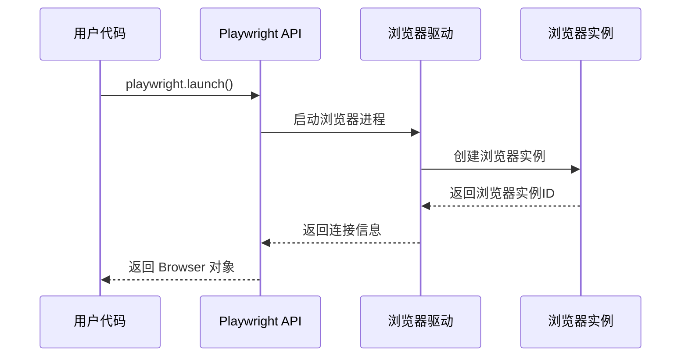

# Playwright 实战：从基础原理到构建 Markdown 图片生成服务

## 一、初识 Playwright：不仅仅是自动化测试工具

### 1.1 Playwright 是什么？

Playwright 是微软推出的端到端（E2E）测试框架，但它的能力远不止于此。它是一个强大的浏览器自动化工具，能够精确控制 Chromium、Firefox 和 WebKit 浏览器，用于测试、爬虫、自动化任务等多种场景。

与传统的 Selenium 相比，Playwright 具有以下优势：

- **更快的执行速度**：直接通过 WebSocket 与浏览器通信
- **更好的稳定性**：内置智能等待机制，减少测试失败
- **更丰富的 API**：提供了大量便捷的浏览器操作方法
- **跨浏览器支持**：一套代码支持三大主流浏览器引擎

### 1.2 Playwright 的核心能力

Playwright 的核心能力主要体现在以下几个方面：

- **跨浏览器支持**：Chromium、Firefox、WebKit 三大引擎
- **现代化 Web 应用支持**：完美支持 SPA、PWA 等现代应用
- **强大的 API 设计**：简洁易用的 API，支持复杂的交互操作
- **无头模式运行**：适合服务器端和 CI/CD 环境

## 二、深入理解 Playwright 架构原理

### 2.1 分层架构设计

Playwright 采用了清晰的分层架构设计：

```
┌─────────────────────────────────────┐
│        用户 API 层 (User API)        │
├─────────────────────────────────────┤
│       协议层 (WebSocket Protocol)    │
├─────────────────────────────────────┤
│      浏览器驱动层 (Browser Drivers)  │
├─────────────────────────────────────┤
│     浏览器引擎层 (Browser Engines)   │
└─────────────────────────────────────┘
```

这种分层设计的优势在于：

- **解耦性强**：每层职责清晰，便于维护和扩展
- **兼容性好**：统一的上层 API，下层适配不同浏览器
- **性能优化**：协议层可以直接与浏览器通信，减少中间环节

### 2.2 浏览器控制机制详解

Playwright 的浏览器控制主要通过以下机制实现：

#### WebSocket 双向通信

Playwright 使用 WebSocket 与浏览器建立持久连接，实现实时的双向通信。这种方式相比传统的 HTTP 请求具有更低延迟和更高的效率。

#### Chrome DevTools Protocol (CDP)

Playwright 基于标准的 Chrome DevTools Protocol 来控制浏览器。CDP 提供了完整的浏览器控制接口，包括页面导航、DOM 操作、网络拦截等功能。

#### 浏览器进程管理

Playwright 采用"自带浏览器"策略，在安装时会下载特定版本的浏览器二进制文件。这种方式确保了：

- **版本一致性**：避免因浏览器版本差异导致的问题
- **环境隔离**：不依赖系统安装的浏览器
- **跨平台兼容**：统一的行为表现

### 2.3 浏览器来源和管理

与 Puppeteer 等工具不同，Playwright 不依赖系统已安装的浏览器，而是：

1. 自动下载和管理浏览器二进制文件
2. 存储在 `node_modules/playwright-core/browsers/` 目录
3. 支持多版本浏览器并存
4. 提供浏览器版本管理命令

## 三、Playwright 核心工作流程解析

### 3.1 初始化阶段



在初始化阶段，Playwright 会：

1. 分配调试端口（默认情况下）
2. 启动浏览器进程（使用 `child_process.spawn()`）
3. 建立 WebSocket 连接
4. 创建浏览器对象供用户调用

### 3.2 页面操作流程

页面操作是 Playwright 的核心功能，主要包括：

- **页面导航**：`page.goto()` 方法实现页面跳转
- **DOM 操作**：通过 JavaScript 注入进行元素操作
- **事件处理**：模拟用户交互，如点击、输入等
- **异步协调**：通过 Promise 管理异步操作状态

关键的技术要点是 **等待策略**。Playwright 内置了智能等待机制，可以自动等待元素出现、页面加载完成等状态，大大提高了脚本的稳定性。

### 3.3 高级功能机制

#### 网络请求拦截

通过 `route` API 可以拦截和修改网络请求：

```typescript
await page.route("**/*", (route) => {
  // 修改请求头
  const headers = route.request().headers();
  headers["X-Custom-Header"] = "Playwright";

  // 继续请求
  route.continue({ headers });
});
```

#### JavaScript 注入和执行

Playwright 可以在页面上下文中执行任意 JavaScript：

```typescript
// 执行脚本并获取结果
const title = await page.evaluate(() => document.title);

// 传递参数到页面上下文
const result = await page.evaluate((param) => {
  return document.querySelector(param)?.textContent;
}, "#title");
```

#### 截图和录屏技术

截图功能是 Playwright 的重要特性，支持多种格式和选项：

```typescript
// 全页面截图
await page.screenshot({
  path: "screenshot.png",
  fullPage: true,
});

// 元素截图
const element = await page.$("#content");
await element?.screenshot({ path: "content.png" });
```

## 四、实战项目：构建 Markdown 图片生成服务

### 4.1 项目背景与需求

在现代内容创作场景中，经常需要将 Markdown 内容转换为美观的图片卡片，用于社交媒体分享、博客头图等。传统的方案有：

- **Canvas 渲染**：需要手动实现文本布局和样式
- **服务端渲染**：需要复杂的 HTML 到图片转换库
- **在线工具**：无法集成到自己的工作流中

使用 Playwright 来实现这个需求的优势在于：

- **精确渲染**：使用真实浏览器，确保渲染效果一致
- **样式丰富**：支持完整的 CSS 样式和字体
- **易于实现**：代码逻辑简单直观

### 4.2 核心 Playwright 逻辑

下面展示如何使用 Playwright 实现 Markdown 图片生成的核心逻辑：

```typescript
import { chromium } from "playwright";
import { marked } from "marked";

// 核心流程：Markdown → HTML → 页面渲染 → 截图输出
async function generateMarkdownCard(markdown: string): Promise<Buffer> {
  // 1. 启动浏览器 - Playwright 的核心启动机制
  const browser = await chromium.launch({
    headless: true, // 无头模式运行
    args: ["--no-sandbox", "--disable-dev-shm-usage"], // Docker 环境优化参数
  });

  // 2. 创建页面上下文 - 理解 Playwright 的隔离机制
  const page = await browser.newPage();

  // 3. 设置页面参数 - 展示 Playwright 的页面配置能力
  await page.setViewportSize({ width: 1200, height: 630 });

  // 4. 设置页面内容 - 核心：HTML 渲染和 DOM 操作
  const htmlContent = `
    <!DOCTYPE html>
    <html>
    <head>
      <meta charset="UTF-8">
      <style>
        body {
          font-family: -apple-system, BlinkMacSystemFont, 'Segoe UI', Roboto, sans-serif;
          margin: 40px;
          background: linear-gradient(135deg, #667eea 0%, #764ba2 100%);
          color: white;
          border-radius: 8px;
        }
        .container {
          max-width: 1120px;
          margin: 0 auto;
          padding: 40px;
          background: rgba(255, 255, 255, 0.1);
          backdrop-filter: blur(10px);
          border-radius: 8px;
        }
        h1 {
          color: #ffffff;
          font-size: 2.5em;
          margin-bottom: 20px;
          border-bottom: 2px solid rgba(255, 255, 255, 0.3);
          padding-bottom: 20px;
        }
        p {
          color: rgba(255, 255, 255, 0.9);
          line-height: 1.8;
          font-size: 1.2em;
          margin-bottom: 16px;
        }
        code {
          background: rgba(0, 0, 0, 0.3);
          padding: 2px 6px;
          border-radius: 4px;
          font-family: 'Monaco', 'Menlo', monospace;
        }
        pre {
          background: rgba(0, 0, 0, 0.3);
          padding: 16px;
          border-radius: 8px;
          overflow-x: auto;
          margin: 20px 0;
        }
        blockquote {
          border-left: 4px solid rgba(255, 255, 255, 0.5);
          padding-left: 20px;
          margin: 20px 0;
          font-style: italic;
        }
      </style>
    </head>
    <body>
      <div class="container">
        ${marked(markdown)}  <!-- 使用 marked 库解析 Markdown -->
      </div>
    </body>
    </html>
  `;

  await page.setContent(htmlContent);

  // 5. 等待页面加载 - Playwright 的等待机制
  await page.waitForLoadState("networkidle");

  // 6. 截图生成 - Playwright 的截图功能
  const screenshot = await page.screenshot({
    type: "png",
    fullPage: false, // 只截取视口大小
  });

  // 7. 资源清理 - 重要：浏览器生命周期管理
  await browser.close();

  return screenshot;
}

// 使用示例
async function createCard() {
  const markdown = `# Playwright 实战

这是一个 **Playwright** 实战项目，展示了如何将 Markdown 内容转换为美观的图片卡片。

## 核心特性

- 🎨 **美观设计**：使用现代 CSS 样式
- 📱 **响应式布局**：适配不同尺寸
- ⚡ **高性能**：基于 Playwright 的快速渲染

\`\`\`javascript
const browser = await chromium.launch();
const page = await browser.newPage();
await page.screenshot();
\`\`\`

> 让技术内容更加美观和易于分享！`;

  const cardImage = await generateMarkdownCard(markdown);

  // 保存图片
  require("fs").writeFileSync("markdown-card.png", cardImage);
  console.log("卡片生成完成：markdown-card.png");
}

createCard().catch(console.error);
```

### 4.3 关键 Playwright API 说明

这个实战项目展示了 Playwright 的几个核心 API：

**`chromium.launch()`** - 浏览器启动的核心 API

- `headless: true`：无头模式，适合服务器环境
- `args` 参数：用于优化浏览器行为，特别是在 Docker 环境中

**`page.setContent()`** - HTML 内容设置和渲染

- 直接设置页面的 HTML 内容
- 自动触发页面渲染和脚本执行
- 支持完整的 HTML 和 CSS 功能

**`page.waitForLoadState('networkidle')`** - 异步等待机制

- 等待网络请求完成，确保页面完全加载
- 避免截图时内容不完整的问题
- 是 Playwright 智能等待机制的体现

**`page.screenshot()`** - 截图生成的核心功能

- 支持 PNG、JPEG 等多种格式
- 可配置截图范围（全页面或指定区域）
- 返回 Buffer 对象，便于后续处理

**浏览器生命周期管理** - 资源清理的重要性

- 必须调用 `browser.close()` 释放资源
- 避免内存泄漏和僵尸进程
- 在服务器环境中特别重要

## 五、基础部署：让项目运行起来

### 5.1 本地开发环境

要在本地运行这个项目，需要以下步骤：

1. **安装依赖**

```bash
npm init -y
npm install playwright marked
npx playwright install  # 安装浏览器
```

2. **创建项目文件**

将上面的代码保存为 `generate-card.js`

3. **运行项目**

```bash
node generate-card.js
```

### 5.2 Docker 容器化运行

为了确保 Playwright 在容器环境中正常运行，需要特别注意依赖和配置：

```dockerfile
# 基于官方 Playwright 镜像
FROM mcr.microsoft.com/playwright:v1.40.0-focal

# 设置工作目录
WORKDIR /app

# 复制依赖文件
COPY package*.json ./

# 安装依赖
RUN npm ci

# 复制源代码
COPY . .

# 暴露端口（如果需要 API 服务）
EXPOSE 3000

# 启动命令
CMD ["node", "generate-card.js"]
```

### 5.3 基础运行配置

**环境变量设置**

```bash
# .env
NODE_ENV=production
PLAYWRIGHT_BROWSERS_PATH=/ms-playwright
```

**健康检查端点**

```typescript
// health-check.js
const { chromium } = require("playwright");

async function healthCheck() {
  try {
    const browser = await chromium.launch({
      headless: true,
      args: ["--no-sandbox", "--disable-dev-shm-usage"],
    });

    const page = await browser.newPage();
    await page.setContent("<html><body>Health Check</body></html>");
    await browser.close();

    console.log("Playwright 运行正常");
    process.exit(0);
  } catch (error) {
    console.error("Playwright 健康检查失败:", error.message);
    process.exit(1);
  }
}

healthCheck();
```

## 六、常见问题排查

**浏览器启动失败**

- **问题表现**：`Error: Failed to launch browser`
- **可能原因**：系统依赖缺失、权限不足、端口被占用
- **解决方案**：

```bash
# 安装系统依赖（Ubuntu/Debian）
apt-get update
apt-get install -y libnss3 libatk-bridge2.0-0 libdrm2 libxkbcommon0

# Docker 环境添加启动参数
args: ['--no-sandbox', '--disable-dev-shm-usage']
```

**截图质量问题**

- **问题表现**：图片模糊、字体缺失、样式不正确
- **可能原因**：字体未安装、等待时间不足、视口设置错误
- **解决方案**：

```typescript
// 安装中文字体
await page.addStyleTag({
  content: `
    @import url('https://fonts.googleapis.com/css2?family=Noto+Sans+SC:wght@400;700&display=swap');
    body { font-family: 'Noto Sans SC', sans-serif; }
  `,
});

// 增加等待时间
await page.waitForTimeout(2000);
```

**内存使用过高**

- **问题表现**：容器内存溢出、响应变慢
- **可能原因**：浏览器未正确关闭、页面过多、内存泄漏
- **解决方案**：

```typescript
// 确保资源清理
try {
  const result = await generateCard(markdown);
  return result;
} finally {
  await browser.close(); // 一定要关闭浏览器
}

// 限制并发数
const semaphore = new Semaphore(3); // 最多3个并发
```

**Docker 环境问题**

- **问题表现**：容器启动失败、浏览器无法运行
- **可能原因**：共享内存配置、用户权限、依赖缺失
- **解决方案**：

```yaml
# Docker Compose 配置
services:
  app:
    volumes:
      - /dev/shm:/dev/shm # 共享内存
    shm_size: 2g # 增加共享内存大小
    user: "1000:1000" # 设置用户ID
```

## 七、核心要点回顾

### 7.1 Playwright 架构理解

通过这次实战，我们深入理解了 Playwright 的核心架构：

- **分层设计的价值**：API 层、协议层、驱动层的分离使得系统具有良好的可扩展性和兼容性
- **CDP 协议的重要性**：作为标准的浏览器控制协议，为 Playwright 提供了强大的功能基础
- **浏览器管理机制**：自带浏览器的策略解决了环境一致性问题

### 7.2 实战应用要点

在实际应用中，需要掌握以下关键点：

- **HTML 渲染 + 截图的核心模式**：这是 Playwright 在内容生成类应用中的典型使用模式

### 7.3 部署运行关键

在部署和运行时，需要特别注意：

- **依赖环境的正确配置**：确保系统依赖、浏览器版本、字体等都正确安装
- **基础监控的必要性**：健康检查和日志记录对于问题排查非常重要
- **问题排查的思路方法**：从启动失败到运行时异常，建立系统化的问题解决思路

Playwright 作为一个强大的浏览器自动化工具，其应用场景远不止测试。通过本次实战，我们看到了它在内容生成、自动化办公、数据采集等领域的巨大潜力。掌握 Playwright 的原理和用法，将为你的技术栈增加一个强大的工具。
