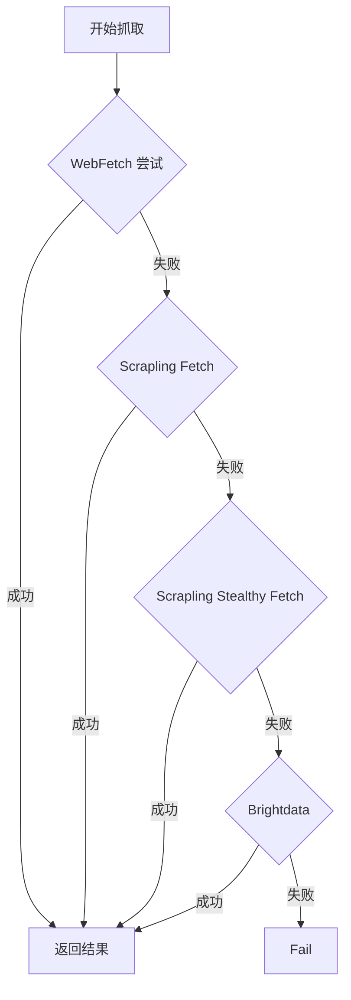

## 背景：AI 工具的网络抓取需求

在使用 AI 编程助手（如 Claude Code）的过程中,我们经常需要让 AI 从互联网获取信息：

- 查找最新的技术文档和 API 说明
- 抓取网页内容进行分析和总结
- 批量获取数据用于开发决策
- 实时查询动态内容

然而,不同网站的反爬虫策略差异巨大,从静态 HTML 到复杂的 JavaScript 渲染,从无保护到 CAPTCHA 验证,这给工具选择带来了挑战。同时,我们还需要考虑：

- **成本控制**：优先使用免费的本地工具,付费服务作为兜底
- **性能要求**：快速响应 vs 完整渲染的权衡
- **成功率保障**：如何在工具失败时自动降级重试

本文将系统性地介绍如何构建一套场景驱动的网络抓取工具配置策略,让 AI 工具能够高效、经济地获取互联网内容。

## 核心概念：理解网站类型和工具特性

在深入工具配置之前,需要先理解几个核心概念,这将帮助你更好地选择和使用工具。

### 工具选择的标准

在配置抓取工具链时,我会考虑的三个原则：

1. **成本优先**
2. **速度权衡**
3. **确保结果**

### 本地部署 vs 远程调用

理解本地和远程部署的区别,对于选择合适的工具至关重要：

| 对比维度 | 本地部署             | 远程调用                |
| -------- | -------------------- | ----------------------- |
| **成本** | 免费                 | 按请求计费              |
| **速度** | 快（无网络延迟）     | 慢（有网络延迟）        |
| **资源** | 占用本地资源         | 不占本地资源            |
| **IP**   | 受本地 IP 限制       | 云端 IP 池              |
| **适用** | 开发测试、小规模抓取 | 大规模生产、需要云端 IP |

**推荐策略**：本地优先,远程备选

### 网站反爬等级识别

根据反爬策略的强度,网站可以分为以下几个等级：

| 反爬等级              | 特征识别                     | 典型网站示例               | 推荐工具类型   |
| --------------------- | ---------------------------- | -------------------------- | -------------- |
| **低防护/静态渲染**   | 查看源代码内容直接可见       | MDN、Wikipedia、技术博客   | HTTP 静态请求  |
| **中等防护/动态渲染** | 源代码为空,需要 JS 渲染      | Medium、新闻网站、企业官网 | 浏览器渲染     |
| **高防护**            | 返回验证页面,检测浏览器指纹  | Amazon、Twitter、YouTube   | 隐身浏览器     |
| **极强防护**          | 出现 CAPTCHA 或 403/429 错误 | 金融平台、票务网站         | 商业级代理服务 |

### 工具分类：按应用场景划分

根据抓取目标的不同,工具可以分为以下几类：

1. **搜索查找工具**：用于查找目标 URL
2. **静态网站抓取工具**：适用于纯 HTML 网站
3. **动态网站抓取工具**：适用于需要 JS 渲染的网站
4. **反爬对抗工具**：适用于有反爬检测的网站
5. **CAPTCHA 突破工具**：适用于极强反爬的网站
6. **批量处理工具**：适用于多 URL 并发抓取

## 工具介绍与配置：按目标类型选择

本章节按照抓取目标的特征来组织工具介绍,每个工具都有独立的配置说明,方便快速查找和使用。

### 搜索查找工具

当你不确定目标 URL,需要先搜索查找时：

- 不确定目标 URL 时的第一步
- 查找最新技术文档的 URL
- 发现相关资源和参考资料
- 不确定具体网址时的信息检索

#### WebSearch

**技术实现**：

- 调用搜索引擎 API（Google、Bing、Brave 等）
- Claude Code 的 WebSearch 使用的是 Brave Search API
- 返回搜索结果列表（标题、URL、摘要）
- 部署方式：远程调用
- 响应速度：1-2 秒
- 成本：免费/按量付费

**使用建议**：

- 搜索结果通常包含 10-20 个链接
- 可以根据标题和摘要初步筛选目标
- 搜索后需要使用其他工具实际抓取页面内容

#### SearXNG

**技术实现**：

- 聚合多个搜索引擎结果
- 可自建服务,无 API 限制
- 隐私保护更好
- 部署方式：本地部署或远程调用，docker
- 响应速度：2-3 秒

**适用场景**：

- 需要大量搜索请求时
- 对隐私保护有要求时
- 需要定制化搜索功能时

**安装配置**：参看 [#SearXNG 安装与配置](#SearXNG-安装与配置)

---

### 静态网站抓取工具

当目标网站是纯静态 HTML 内容时：

- 技术文档（MDN、GitHub Docs）
- 个人博客（Hugo、Jekyll、Hexo）
- 维基百科类网站
- 静态 HTML 页面

**典型特征**：

- 纯静态 HTML 内容
- 无 JavaScript 渲染需求
- URL 通常包含 `.html`、`/docs/`、`/blog/` 等标识

#### WebFetch

**技术实现**：

- 直接发送 HTTP 请求,获取 HTML 源码
- 不启动浏览器,不执行 JavaScript
- 支持自定义 HTTP 头和 Cookie
- 部署方式：内置工具
- 响应速度：< 1 秒（最快）
- 资源占用：极低（仅网络请求）
- 成本：免费

**使用建议**：

- **首选工具**：静态网站的最快选择
- 适用于技术文档、个人博客
- 不适用于需要 JS 渲染的网站

#### Scrapling Get

**技术实现**：

- 伪装成真实浏览器的 HTTP 请求
- 支持 TLS 指纹伪造
- 部署方式：本地部署
- 响应速度：< 1 秒
- 成本：免费

**安装配置**：参看 [#Scrapling 安装与配置](#Scrapling-安装与配置)

---

### 无反爬的动态网站

#### 适用场景

当目标网站需要 JavaScript 渲染,但没有明显反爬检测时：

- 新闻媒体网站（CNN、BBC）
- 内容聚合平台（Medium）
- 企业官网和产品页面
- 单页应用（React/Vue/Angular）

**场景识别**：

1. 使用 WebFetch 尝试抓取
2. 如果返回内容为空或不完整,则需要 JavaScript 渲染
3. 访问网站时未触发验证页面

**典型特征**：

- 内容通过 JavaScript 加载（查看源代码为空）
- 无明显的反爬检测（不检查浏览器指纹）
- 首次访问不触发 CAPTCHA 或验证页面

#### Playwright

**技术实现**：

- 微软开发的浏览器自动化工具
- 支持 Chromium、Firefox、WebKit
- 完整的浏览器 API 支持
- 部署方式：本地部署
- 响应速度：1-3 秒
- 成本：免费

**安装配置**：参看 [#Playwright 安装与配置](#Playwright-安装与配置)

#### Scrapling Fetch

**技术实现**：

- 基于 Playwright,启动 Chromium 浏览器
- 执行 JavaScript,获取渲染后的 DOM
- 支持等待元素、网络空闲等智能策略
- 部署方式：本地部署
- 响应速度：1-3 秒
- 资源占用：中等（浏览器进程）
- 成本：免费

**安装配置**：参看 [#Scrapling 安装与配置](#Scrapling-安装与配置)

### 有反爬的动态网站

#### 适用场景

当目标网站有浏览器指纹检测等反爬机制时：

- 电商平台（Amazon、淘宝、京东）
- 社交媒体（Twitter、Instagram、Facebook）
- 视频平台（YouTube、bilibili、抖音）
- 在线服务平台

**场景识别**：

1. 使用 Scrapling Fetch/Playwright 抓取失败（返回验证页面或空内容）
2. 浏览器控制台出现反爬检测相关的 JavaScript 代码
3. 网络请求中包含指纹计算相关的接口调用

**典型特征**：

- 检测浏览器指纹（Canvas、WebGL、字体）
- 检查 User-Agent、WebRTC 泄露
- 异常流量触发验证页面（但不是 CAPTCHA）

**反爬特征字符串示例**：

```html
<!-- Cloudflare 挑战页面 -->
<title>Just a moment...</title>

<!-- PerimeterX 检测 -->
<script src="//client.perimeterx.net/..."></script>

<!-- 自定义验证 -->
<div id="verify-page">请完成验证</div>
```

#### Scrapling Stealthy Fetch

**技术实现**：

- 基于 Camoufox（Firefox 的隐身版本）
- 随机化浏览器指纹（Canvas、WebGL、字体等）
- 伪造 WebRTC IP、时区、语言等特征
- 支持鼠标轨迹模拟（Humanize）
- 部署方式：本地部署
- 响应速度：3-5 秒
- 资源占用：高（浏览器 + 指纹伪造）
- 成本：免费

**安装配置**：参看 [#Scrapling 安装与配置](#Scrapling-安装与配置)

**使用建议**：

- **首选工具**：反爬网站的最佳选择
- 免费且成功率高
- 指纹伪造技术先进
- 响应速度较慢,资源占用较高

### 极强反爬网站

#### 适用场景

当目标网站使用 CAPTCHA 或其他高强度反爬手段时：

- 金融和证券交易平台
- 票务预订网站（机票、演唱会、体育赛事）
- 高价值数据网站（房产、招聘、医疗）
- 需要突破 CAPTCHA 的场景

**场景识别**：

1. Scrapling Stealthy Fetch 失败（返回 CAPTCHA 页面）
2. 页面包含 `<iframe>` 或 `<div>` 中的验证组件
3. 网络请求显示 Cloudflare Challenge 或 reCAPTCHA API 调用

**典型特征**：

- Cloudflare Turnstile、reCAPTCHA 验证码
- 频繁触发 403/429 错误
- 即使使用隐身浏览器也无法通过

#### Brightdata

**技术实现**：

- 全球住宅 IP 代理池（高可信度）
- 自动处理 CAPTCHA 和 JavaScript 挑战
- 专业的反反爬技术团队维护
- 部署方式：远程调用
- 响应速度：5-15 秒（预估）
- 成功率：极高（商业级保障）
- 成本：**高**（按请求或流量计费）

**安装配置**：参看 [#Brightdata 安装与配置](#Brightdata-安装与配置)

**使用建议**：

- **兜底方案**：仅在免费工具全部失败后使用
- 使用前要求用户确认
- 不适合高频批量抓取（成本过高）

---

### 工具选择速查表

快速查找不同场景下的推荐工具：

| 目标类型            | 首选工具（本地）   | 备选工具（远程）   | 响应速度 | 成本    |
| ------------------- | ------------------ | ------------------ | -------- | ------- |
| 搜索查找            | WebSearch          | SearXNG            | 1-2s     | 免费    |
| 静态网站            | WebFetch           | Scrapling Get      | < 1s     | 免费    |
| 动态网站（无反爬）  | Scrapling Fetch    | Scrapling Fetch    | 1-5s     | 免费/低 |
| 动态网站（有反爬）  | Scrapling Stealthy | Scrapling Stealthy | 3-10s    | 免费/中 |
| 极强反爬（CAPTCHA） | Brightdata         | -                  | 5-15s    | 高      |

## 工具安装与配置

### SearXNG 安装与配置

- http 版本：

```bash
# Docker 部署
docker run --name searxng -d \
  -p 8080:8080 \
  -v $appDir/searxng/config:/etc/searxng \
  -v $appDir/searxng/data:/var/cache/searxng\
  docker.io/searxng/searxng:latest

# Searxng 查询 URL
http://127.0.0.1:8080/search?q=<query>
```

- MCP 版本：

```bash
# install @tisddm/searxng-mcp
npm install -g @tisddm/searxng-mcp

# add mcp server
claude mcp add searxng npx -y @tisddm/searxng-mcp
```

### Scrapling 安装与配置

- https://scrapling.readthedocs.io/en/latest/ai/mcp-server/

#### 本机安装

```bash
# 本机获取代码并安装
git clone git@github.com:D4Vinci/Scrapling.git

cd ./Scrapling

pip install "scrapling[ai]"

scrapling install

# 添加 scrapling_local MCP（注意通过 which scrapling 获取 Scrapling bin 的路径）
claude mcp add -s user scrapling_local "$xxx/bin/scrapling" mcp
```

#### 远程安装

```bash
# Docker 部署
docker run -d \
    --name scrapling-mcp \
    -p 8301:8301 \
    --memory 1g \
    --memory-swap 2g \
    ghcr.io/d4vinci/scrapling:latest \
    mcp --http --host 0.0.0.0 --port 8301

# 添加 Docker Scrapling MCP
claude mcp add -s user -t http scrapling http://127.0.0.1:8301/mcp
```

### Playwright 安装与配置

```bash
# 添加 MCP
claude mcp add -s user -t stdio playwright -- npx @playwright/mcp@latest --headless --isolated
```

### Brightdata 安装与配置

- github: https://github.com/bright-cn/brightdata-mcp

```bash
# 注册/登录 获取 $TOKEN
https://brightdata.com/cp/start

# 添加 MCP
claude mcp add -s user --transport sse brightdata "https://mcp.brightdata.com/sse?token=$TOKEN"
```

## 配置策略：构建智能工具链

在理解了各个工具的特性后,我们需要将它们组织成一个智能的工具链,实现自动降级和成本控制。

- 策略 1：降级重试链
- 策略 2：性能优化
  - 优先使用本地工具
  - 批量抓取优化

**核心思想**：从最快的工具开始,失败后自动降级到更强大的工具,同类工具优先使用本地版本

**推荐工具链**：

```
WebFetch → Scrapling Fetch → Scrapling Stealthy Fetch → Brightdata
```

**降级逻辑流程图**：



**实现方案**：

- 在你的 CLAUDE.md 文件中添加以下配置：

```md
### 智能网页抓取降级策略

当需要抓取网页内容时，**自动执行**以下降级重试链：

#### 降级顺序

1. **WebFetch**（优先）
   - 适用：静态 HTML 页面、简单博客
   - 优势：最快，无成本
   - 失败条件：403/超时/需要 JS 渲染 → 进入步骤 2
2. **Scrapling Fetch**
   - 工具：优先 `mcp__scrapling_local__fetch`，备用 `mcp__scrapling__fetch`
   - 适用：需要 JS 渲染的普通动态网站
   - 优势：Playwright 浏览器，无成本
   - 失败条件：反爬虫检测/加载超时 → 进入步骤 3
3. **Scrapling Stealthy Fetch**
   - 工具：优先 `mcp__scrapling_local__stealthy_fetch`，备用 `mcp__scrapling__stealthy_fetch`
   - 适用：中高级反爬虫保护
   - 优势：Camoufox 浏览器 + 反检测技术，无成本
   - 失败条件：极强反爬虫/CAPTCHA → 进入步骤 4
4. **Brightdata**（兜底）
   - 工具：`mcp__brightdata__scrape_as_markdown`
   - 适用：极强反爬虫保护、CAPTCHA、地理限制
   - **成本警告**：消耗 API token
   - 使用前必须：说明这是最后手段，将产生费用

#### 执行规则

- **自动执行**：无需用户指定，按顺序自动尝试
- **立即停止**：任一工具成功后立即停止，不再尝试后续工具
- **失败说明**：每次失败要说明原因（如：403、反爬虫检测、超时）
- **本地优先**：优先使用 `mcp__scrapling_local__*`，然后是 `mcp__scrapling__*`
- **成本提醒**：使用 Brightdata 前必须提醒用户
- **过程透明**：清晰展示当前使用的工具和降级原因

#### 特殊场景优化

- **已知静态页面**：可直接使用 WebFetch（跳过降级链）
- **已知强反爬虫**：可直接使用 Stealthy Fetch（跳过前两步）
- **搜索场景**：先用 WebSearch 找 URL，再执行抓取
```

## 总结

### 核心原则

通过本文,我们构建了一套完整的 AI 网络抓取工具配置策略,核心原则可以总结为：

**1. 场景驱动**

- 不同网站使用不同工具,避免一刀切
- 根据反爬级别智能选择,提高成功率

**2. 成本优先**

- 优先使用免费的本地工具
- 付费服务作为兜底,严格控制使用

**3. 自动降级**

- 从最快的工具开始尝试
- 失败后自动降级到更强大的工具
- 最大化成功率的同时最小化成本

### 工具选择决策树

```
开始抓取
├─ 第一步：查找信息
│  └─ 不确定 URL → WebSearch / SearXNG
│
├─ 第二步：检查域名规则
│  ├─ 命中规则 → 使用指定工具
│  └─ 未命中 → 进入第三步
│
├─ 第三步：尝试最快工具
│  ├─ 静态网站 → WebFetch
│  │  ├─ 成功 → 返回
│  │  └─ 失败 → 进入第四步
│  │
│  └─ 动态网站 → 进入第四步
│
├─ 第四步：浏览器渲染
│  ├─ Playwright / Scrapling Fetch（无反爬）
│  │  ├─ 成功 → 返回
│  │  └─ 检测到反爬 → 进入第五步
│  │
│  └─ 失败 → 进入第五步
│
├─ 第五步：隐身浏览器
│  ├─ Scrapling Stealthy Fetch
│  │  ├─ 成功 → 返回
│  │  └─ 检测到 CAPTCHA → 进入第六步
│  │
│  └─ 失败 → 进入第六步
│
└─ 第六步：付费服务（需确认）
   ├─ 用户确认
   └─ Brightdata
      ├─ 成功 → 返回
      └─ 失败 → 返回错误
```

配置完网络抓取工具配置策略,将大幅提升 AI 工具获取互联网信息的效率和经济性。无论是日常开发中的文档查询,还是复杂的数据采集任务,都能找到最合适的工具组合。
